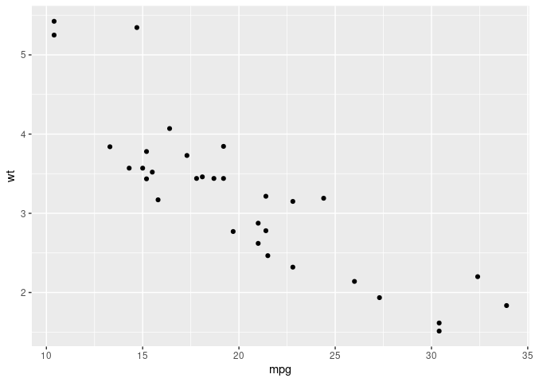

hello
================
xinyu
2024-03-03

``` r
library(tidymodels)
```

    ## ── Attaching packages ────────────────────────────────────── tidymodels 1.1.1 ──

    ## ✔ broom        1.0.5     ✔ recipes      1.0.8
    ## ✔ dials        1.2.0     ✔ rsample      1.2.0
    ## ✔ dplyr        1.1.4     ✔ tibble       3.2.1
    ## ✔ ggplot2      3.4.4     ✔ tidyr        1.3.0
    ## ✔ infer        1.0.5     ✔ tune         1.1.2
    ## ✔ modeldata    1.2.0     ✔ workflows    1.1.3
    ## ✔ parsnip      1.1.1     ✔ workflowsets 1.0.1
    ## ✔ purrr        1.0.2     ✔ yardstick    1.2.0

    ## ── Conflicts ───────────────────────────────────────── tidymodels_conflicts() ──
    ## ✖ purrr::discard() masks scales::discard()
    ## ✖ dplyr::filter()  masks stats::filter()
    ## ✖ dplyr::lag()     masks stats::lag()
    ## ✖ recipes::step()  masks stats::step()
    ## • Use suppressPackageStartupMessages() to eliminate package startup messages

``` r
glimpse(mtcars)
```

    ## Rows: 32
    ## Columns: 11
    ## $ mpg  <dbl> 21.0, 21.0, 22.8, 21.4, 18.7, 18.1, 14.3, 24.4, 22.8, 19.2, 17.8,…
    ## $ cyl  <dbl> 6, 6, 4, 6, 8, 6, 8, 4, 4, 6, 6, 8, 8, 8, 8, 8, 8, 4, 4, 4, 4, 8,…
    ## $ disp <dbl> 160.0, 160.0, 108.0, 258.0, 360.0, 225.0, 360.0, 146.7, 140.8, 16…
    ## $ hp   <dbl> 110, 110, 93, 110, 175, 105, 245, 62, 95, 123, 123, 180, 180, 180…
    ## $ drat <dbl> 3.90, 3.90, 3.85, 3.08, 3.15, 2.76, 3.21, 3.69, 3.92, 3.92, 3.92,…
    ## $ wt   <dbl> 2.620, 2.875, 2.320, 3.215, 3.440, 3.460, 3.570, 3.190, 3.150, 3.…
    ## $ qsec <dbl> 16.46, 17.02, 18.61, 19.44, 17.02, 20.22, 15.84, 20.00, 22.90, 18…
    ## $ vs   <dbl> 0, 0, 1, 1, 0, 1, 0, 1, 1, 1, 1, 0, 0, 0, 0, 0, 0, 1, 1, 1, 1, 0,…
    ## $ am   <dbl> 1, 1, 1, 0, 0, 0, 0, 0, 0, 0, 0, 0, 0, 0, 0, 0, 0, 1, 1, 1, 0, 0,…
    ## $ gear <dbl> 4, 4, 4, 3, 3, 3, 3, 4, 4, 4, 4, 3, 3, 3, 3, 3, 3, 4, 4, 4, 3, 3,…
    ## $ carb <dbl> 4, 4, 1, 1, 2, 1, 4, 2, 2, 4, 4, 3, 3, 3, 4, 4, 4, 1, 2, 1, 1, 2,…

``` r
ggplot(data = mtcars,aes(x=mpg,y=wt))+geom_point()
```

<!-- -->
